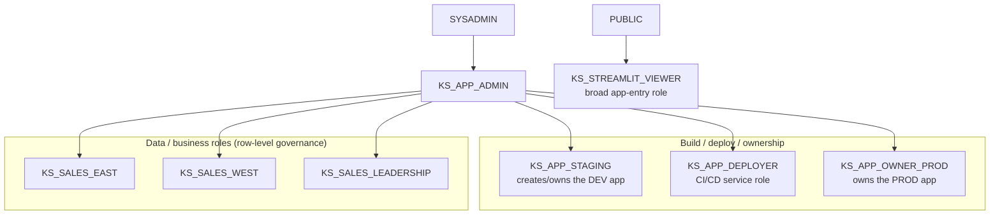

# Role hierarchy, environments & governance

## The mistake everyone makes first

I've talked at length to customers and SEs about the spectrum of apps that exist
in Snowflake. That term, `app` can mean a lot of different things. We can define
it via a spectrum of runtimes, deployments, and tech stacks; it can live
_inside_ the perimeter or _outside_ of it on a customer's cloud or (if they're a
masochist) on-prem.

Let's start by talking about Streamlits, which has just about the lowest barrier
to entry imaginable for applications. You (or your LLM) can write Python?
Brilliant - you can write a web app. The very first instinct, when you share a
Streamlit app in Snowflake, is to create a role for it. `SALES_APP_VIEWER`, say.
You grant it to the people who should see the app, and you feel organized. Then
you build a second app, and a third, and by the fifth you've got a snarl of
near-identical viewer roles, nobody remembers which one gates what, and someone
in leadership still can't see the dashboard they asked for last Tuesday.

The fix is to stop conflating three completely different questions that only
*look* like the same question:

- **App creation** — who may *build and deploy* an app. This should be a short
list of dedicated build roles, and nobody else.
- **App access** — who may *open* an app. This should be broad, boring, and
reused across every app you ever ship.
- **Data access** — what a user actually *sees inside*. This is governed by the
business roles and row-level security you (hopefully) already have — not by
whoever happened to click the app.

Keep those three apart and the snarl never forms. Here's what that looks like.

## Three layers, one hierarchy

Since this _is_ the "Kitchen Sink" example (and I only have one Snowflake demo
account) and my OCD dictates I should keep things as organized as possible,
we'll prefix these objects with `KS_*`.

On the _application_ side `KS_STREAMLIT_VIEWER` hangs off `PUBLIC`, so
*everyone* can open the apps — that's the point: visibility. Why not? _Everyone_
gets it. 

On the _data_ side, every business role rolls up to `KS_APP_ADMIN` (and
transitively `SYSADMIN`), so an operator can impersonate any region to test what
a real viewer would see, without keeping a spreadsheet of test accounts.

| Role | Layer | Purpose | Key privileges |
|------|-------|---------|----------------|
| `KS_STREAMLIT_VIEWER` | Access | Broad app entry, reused across every app | `USAGE ON STREAMLIT` (per app); granted to `PUBLIC` |
| `KS_SALES_EAST` | Data | Business role — East sales | `SELECT` on sales data; rows filtered by policy |
| `KS_SALES_WEST` | Data | Business role — West sales | same, West |
| `KS_SALES_LEADERSHIP` | Data | Business role — sales leadership | same, all regions |
| `KS_APP_ADMIN` | Build | Governance; inherits all functional roles | (inherits everything) |
| `KS_APP_STAGING` | Build | Creates/owns the **staging** app | OWNERSHIP on `KITCHEN_SINK_STAGING.APPS`, `CREATE STREAMLIT`, `USAGE` on `KS_WH` + pool |
| `KS_APP_DEPLOYER` | Build | CI/CD service role | `CREATE STREAMLIT` + `USAGE` on **both** `APPS` schemas, warehouse, pool |
| `KS_APP_OWNER_PROD` | Build | Owns the **prod** app | OWNERSHIP on `KITCHEN_SINK_PROD.APPS`, warehouse, pool |

## Why it's shaped this way

**Locking down who can build.** `CREATE STREAMLIT` is a schema-level privilege,
and here it lives *only* on the dedicated build roles — `KS_APP_STAGING` (which
also owns the staging `APPS` schema), `KS_APP_DEPLOYER`, and
`KS_APP_OWNER_PROD`. It is deliberately *not* granted to `KS_STREAMLIT_VIEWER`,
the business roles, or `PUBLIC`. So a user who can open every app in the account
still can't create or clobber one — opening an app and building an app are
different verbs.

**Sharing broadly, governing at the data layer.** One `KS_STREAMLIT_VIEWER`
role, granted to `PUBLIC`, lets everyone in. You never mint a viewer role per
app again. What each person actually *sees* is decided somewhere else entirely —
by their business role and a row access policy.

**Reusing the business roles you already have.** `KS_SALES_EAST`,
`KS_SALES_WEST`, and `KS_SALES_LEADERSHIP` are stand-ins for the functional
roles a real org _already_ runs on. They carry the `SELECT` grants and gate
*object* access; the row access policy handles *rows*. Nothing here is
app-specific — your governance doesn't get a parallel universe just because the
front end is Streamlit or whatever other runtime you've chosen.

**This is only safe under restricted caller's rights.** An **owner's-rights**
app queries as its *owner*, so sharing it to `KS_STREAMLIT_VIEWER` would hand
every single viewer the owner's full, unfiltered data — the business roles and
row policy get quietly bypassed. A **restricted caller's-rights** app queries as
the *viewer*, so their data grants and the row policy actually apply. Sharing
broadly only works because of that second model, which is what the [next
chapter](02-rights-model.md) is about.

Roles are created by `USERADMIN`, granted by `SECURITYADMIN`, and objects are
owned by `SYSADMIN`. It's all in `sql/00_foundation/01_roles.sql` if you want to
see who does what.

> **One subtlety about caller's rights:** it runs with the viewer's *default*
> role (secondary roles need an explicit `USE SECONDARY ROLES`). The row policy
> here keys on `CURRENT_USER()` through an entitlement table rather than on
> role, so row visibility holds up no matter which role the viewer happens to
> have active. More on why that matters next chapter.

## Environments

| Database | Schema | Owner role | Purpose |
|----------|--------|-----------|---------|
| `KITCHEN_SINK_STAGING` | `APPS` | `KS_APP_STAGING` | development |
| `KITCHEN_SINK_PROD` | `APPS` | `KS_APP_OWNER_PROD` | production |

Shared query warehouse: `KS_WH` (XSMALL, auto-suspend 60s — this is a demo, not
a data center). Compute pool: `SYSTEM_COMPUTE_POOL_CPU`, the account default,
because the app runs on the container runtime.

Why two environments? In any robust and mature engineering organization, you'll
want to validate and test your application(s) before they reach end users. A
`staging` environment that mirrors what's on `main` of the repository gives you
a realistic and immediate representation of what's about to reach your
production application on the next deployment. When we get to the CI/CD section,
we'll also talk about ephemeral sandboxes that can be automatically created and
destroyed in conjunction with the lifecycle of a PR.

## Next Up

Everything so far has been foundational to answer the question: how do we share
an application? Next, we'll look at how to ensure that - regardless of who the
application is shared with - anyone who opens the application will only be able
to see the data they're allowed to see: one app, shared to everyone via
`KS_STREAMLIT_VIEWER`, running the *same query* through an owner's-rights
connection and a restricted caller's-rights connection side by side. You'll
watch the data layer — not the app grant — decide what each viewer sees.
