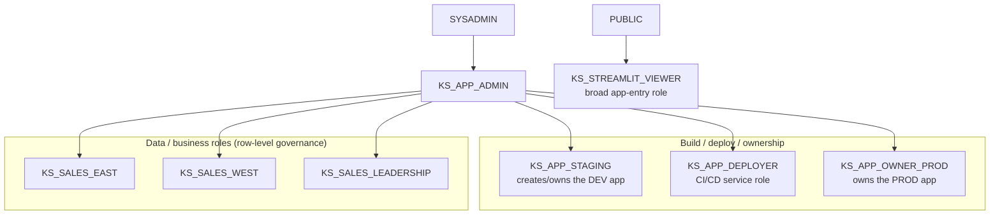

# Role hierarchy, environments & governance

This is the foundation the other patterns build on. It answers a common question:
**what's the best way to share and govern Streamlit in Snowflake apps?** The answer
separates three concerns that are easy to conflate:

- **App creation** — who may *build and deploy* an app. Scoped here to a small
  set of dedicated build roles.
- **App access** — who may *open* an app. Keep this broad and reuse it across apps.
- **Data access** — what a user *sees inside*. Govern this with your existing
  business roles and row-level security, not with per-app roles.

## Three layers, one hierarchy

`KS_STREAMLIT_VIEWER` is granted to `PUBLIC`, so every user can open apps. The
business roles roll up to `KS_APP_ADMIN` (and transitively `SYSADMIN`) so an
operator can test-view the app as any region.

| Role | Layer | Purpose | Key privileges |
|------|-------|---------|----------------|
| `KS_STREAMLIT_VIEWER` | Access | Broad app entry, reused across every app | `USAGE ON STREAMLIT` (per app); granted to `PUBLIC` |
| `KS_SALES_EAST` | Data | Business role — East sales | `SELECT` on sales data (Phase 2); rows filtered by policy |
| `KS_SALES_WEST` | Data | Business role — West sales | same, West |
| `KS_SALES_LEADERSHIP` | Data | Business role — sales leadership | same, all regions |
| `KS_APP_ADMIN` | Build | Governance; inherits all functional roles | (inherits everything) |
| `KS_APP_STAGING` | Build | Creates/owns the **staging** app | OWNERSHIP on `KITCHEN_SINK_STAGING.APPS`, `CREATE STREAMLIT`, `USAGE` on `KS_WH` + pool |
| `KS_APP_DEPLOYER` | Build | CI/CD service role | `CREATE STREAMLIT` + `USAGE` on **both** `APPS` schemas, warehouse, pool |
| `KS_APP_OWNER_PROD` | Build | Owns the **prod** app | OWNERSHIP on `KITCHEN_SINK_PROD.APPS`, warehouse, pool |

### Why this shape

- **Lock down who can build.** `CREATE STREAMLIT` is a schema-level privilege
  held only by the dedicated build roles — `KS_APP_STAGING` (and the schema
  ownership it has in dev), `KS_APP_DEPLOYER`, and `KS_APP_OWNER_PROD` in prod.
  It is *not* granted to `KS_STREAMLIT_VIEWER`, business roles, or `PUBLIC`, so a
  user who can open every app still cannot create or modify one.
- **Share broadly, govern at the data layer.** A single `KS_STREAMLIT_VIEWER`
  role (granted to `PUBLIC`) lets everyone open apps. You never create a viewer
  role per app. What each user actually sees is decided by their business role
  and a row access policy — not by who can open the app.
- **Reuse existing business roles.** `KS_SALES_*` stand in for the functional
  roles a real org already has. They carry the data `SELECT` grants and gate
  *object* access; the row access policy governs *rows*.
- **This is only safe under restricted caller's rights.** An **owner's-rights**
  app queries as its *owner*, so sharing it to `KS_STREAMLIT_VIEWER` would show
  every viewer the owner's full data — the business role and row policy are
  bypassed. A **restricted caller's-rights** app queries as the *viewer*, so the
  viewer's data grants and the row policy apply. That contrast is the point of
  the next pattern.
- **Separation of duties.** Roles are created by `USERADMIN`, granted by
  `SECURITYADMIN`, and objects are owned by `SYSADMIN`. See
  `sql/00_foundation/01_roles.sql`.

> **Caller's-rights detail:** restricted caller's rights run with the viewer's
> *default* role (secondary roles require `USE SECONDARY ROLES`). Because the row
> policy here keys on `CURRENT_USER()` via a mapping table (not on role), row
> visibility is robust regardless of which role the viewer has active.

## Environments

| Database | Schema | Owner role | Purpose |
|----------|--------|-----------|---------|
| `KITCHEN_SINK_STAGING` | `APPS` | `KS_APP_STAGING` | development |
| `KITCHEN_SINK_PROD` | `APPS` | `KS_APP_OWNER_PROD` | production |

Shared query warehouse: `KS_WH` (XSMALL, auto-suspend 60s).
Compute pool: `SYSTEM_COMPUTE_POOL_CPU` (account default; container runtime).

## Next

The next pattern makes this tangible: a single Streamlit app, shared broadly via
`KS_STREAMLIT_VIEWER`, that queries the same table through an **owner's-rights**
connection and a **restricted caller's-rights** connection side by side — so you
can watch the data layer, not the app grant, decide what each viewer sees.
