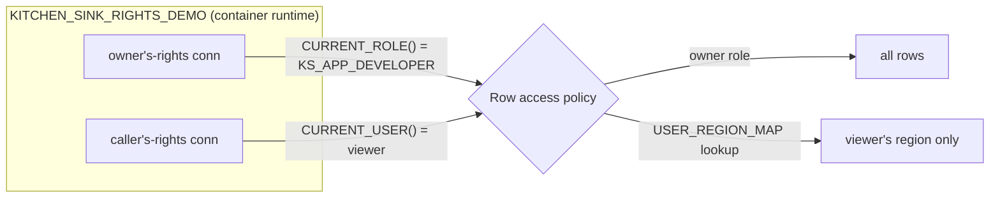

# Owner's rights vs. restricted caller's rights

One Streamlit app runs the **same query** through two connections, side by side:

| Column | Connection | Runs as | Sees |
|--------|-----------|---------|------|
| Owner's rights | `st.connection("snowflake")` | the app **owner** role | every row |
| Restricted caller's rights | `st.connection("snowflake-callers-rights")` | the **viewer** | only their entitled rows |

The contrast is produced entirely by a **row access policy** on
`KITCHEN_SINK_DEV.APPS.SALES_BY_REGION` — the app code is identical on both sides.

## How it works



- **Owner's rights** executes with the app owner's role. In Streamlit in
  Snowflake, `CURRENT_ROLE()` under owner's rights is *always* the owner role, so
  the policy's owner branch returns a full view.
- **Restricted caller's rights** executes as the signed-in viewer, so
  `CURRENT_USER()` is the viewer. The policy joins that to `USER_REGION_MAP` and
  returns only the entitled region (`ALL` sees everything).

### Why caller's rights needs two things

Restricted caller's rights is an **intersection**:

1. the viewer must actually hold `SELECT` on the table (business roles
   `KS_SALES_*` carry it), **and**
2. the app owner role must hold a matching **caller grant**
   (`GRANT CALLER SELECT ON TABLE … TO ROLE KS_APP_DEVELOPER`).

The app also runs `USE SECONDARY ROLES ALL` on the caller's-rights connection so
the viewer's business role (which holds `SELECT`) is active — caller's rights
otherwise uses only the viewer's *default* role.

### Requirements (all applied by the SQL in this repo)

- Container runtime (`SYSTEM$ST_CONTAINER_RUNTIME_PY3_11`) — caller's rights is
  not available in the warehouse runtime.
- `GRANT READ SESSION ON ACCOUNT TO ROLE KS_APP_DEVELOPER` — required for
  `CURRENT_USER()` + row access policies inside SiS.
- `MANAGE CALLER GRANTS` delegated to `KS_APP_ADMIN`, which grants the caller
  privileges to the owner role.

## Build it

```bash
# 1. Data + policy + caller grants (run after Phase 1 foundation)
snow sql -c <connection> -f sql/10_demo_data/01_sales_table.sql
snow sql -c <connection> -f sql/10_demo_data/02_user_region_map.sql
snow sql -c <connection> -f sql/10_demo_data/03_row_access_policy.sql
snow sql -c <connection> -f sql/20_caller_grants/01_caller_grants.sql

# 2. Deploy the app as the dev owner role
cd app
snow streamlit deploy rights_demo -c <connection> --replace
# then grant the broad entry role USAGE on the app:
snow sql -c <connection> -q "GRANT USAGE ON STREAMLIT KITCHEN_SINK_DEV.APPS.KITCHEN_SINK_RIGHTS_DEMO TO ROLE KS_STREAMLIT_VIEWER;"
```

> The app must be **owned by `KS_APP_DEVELOPER`** so its owner's-rights column
> matches the policy's owner branch. Deploy while that role is active.

## Verify

### Data layer (SQL — already confirmed)

```sql
-- Owner role: full view (6 rows, EAST + WEST)
USE ROLE KS_APP_DEVELOPER;
SELECT COUNT(*), LISTAGG(DISTINCT region, ',') FROM KITCHEN_SINK_DEV.APPS.SALES_BY_REGION;

-- Non-owner (mapped user): filtered to their region
USE ROLE KS_SALES_EAST;
SELECT COUNT(*), LISTAGG(DISTINCT region, ',') FROM KITCHEN_SINK_DEV.APPS.SALES_BY_REGION;
```

### In the app (browser)

Open the app and compare the two columns:

`https://app.snowflake.com/<org>/<account>/#/streamlit-apps/KITCHEN_SINK_DEV.APPS.KITCHEN_SINK_RIGHTS_DEMO`

- [ ] **Owner's rights** column shows **all 6 rows** (EAST + WEST).
- [ ] **Restricted caller's rights** column shows only the region mapped to your
      user in `USER_REGION_MAP` (seeded to **EAST** for the current operator).
- [ ] `CURRENT_USER()` matches on both sides; `CURRENT_ROLE()` differs (owner
      role on the left, your role on the right).
- [ ] Re-map your user to `WEST` (or `ALL`) and refresh — the caller's-rights
      column changes while the owner's-rights column stays full.

```sql
-- Flip the entitlement to demo the change:
UPDATE KITCHEN_SINK_DEV.APPS.USER_REGION_MAP SET region = 'WEST' WHERE username = CURRENT_USER();
```

For a multi-user demo, create additional users mapped to different regions and
open the app as each.
