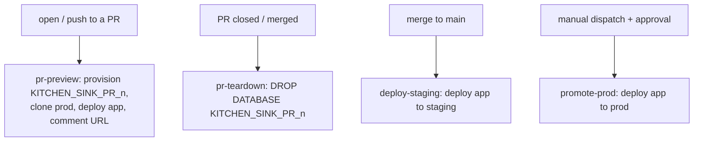

# CI/CD and environment promotion

The app is promoted through environments by GitHub Actions; data flows the other
way by zero-copy clone. **Code goes up, data comes down.**

## Three tiers

| Tier | Database | Lifecycle |
|------|----------|-----------|
| **prod** | `KITCHEN_SINK_PROD` | source of truth; app promoted here behind an approval gate |
| **staging** | `KITCHEN_SINK_STAGING` | app deployed on merge to `main`; `DATA` is a scheduled clone of prod |
| **preview** | `KITCHEN_SINK_PR_<n>` | ephemeral, per-PR; transient db cloned from prod, dropped on close |

The app is **environment-agnostic** — it resolves `CURRENT_DATABASE()` and queries
its own `DATA` schema — so the identical artifact runs in every tier. That is what
makes preview environments essentially free.

## Workflows

- **pr-preview** (`opened`/`synchronize`/`reopened`): a full preview environment
  per commit — no production tables, just a fresh clone of prod data in an
  isolated transient database. The preview URL is posted (and updated) as a PR
  comment.
- **pr-teardown** (`closed`): drops the PR database — covers both merge and close.
- **deploy-staging** (push to `main`): promotes the app code to staging.
- **promote-prod** (manual): gated by the `production` GitHub Environment's
  required reviewers before deploying to prod.

## The CI identity is least-privilege

Everything runs as the `KS_DEPLOYER` service user (key-pair / `SNOWFLAKE_JWT`)
using the `KS_APP_DEPLOYER` role. That role holds only what it needs — the env
owner roles (to deploy/own apps), `CREATE DATABASE` (for preview dbs),
`MANAGE CALLER GRANTS`, and `CREATE SCHEMA` on staging. It is **never** granted
`SYSADMIN` or `ACCOUNTADMIN`. The clone/provision SQL runs entirely under this
scoped role.

## Requirements

- **GitHub secrets:** `SNOWFLAKE_ACCOUNT`, `SNOWFLAKE_USER` (`KS_DEPLOYER`),
  `SNOWFLAKE_PRIVATE_KEY`.
- **`production` environment** with required reviewers (the promote-prod gate).
- **Network access.** If the account enforces an IP/VPN network policy,
  GitHub-hosted runners (dynamic IPs) are blocked. Two options:
  - *Self-hosted runner* inside the allowed network — narrowest, no policy change.
    Preferred for strict environments.
  - *User-scoped network policy* on `KS_DEPLOYER` allowlisting GitHub Actions IP
    ranges (a user-level policy overrides the account policy for that user only).
    `scripts/refresh_gh_actions_network_policy.py` builds it, and the
    `network-policy-refresh` workflow re-runs weekly (GitHub rotates the ranges)
    under a narrowly-scoped `KS_NETPOLICY_ADMIN` role that owns only that policy
    and its rules. Caveat: this allows all GitHub runner IPs (broad) — prefer a
    self-hosted runner where narrow IPs matter.

## Why previews clone prod (not staging)

Only the automated pipeline — never a developer — holds the privilege to clone
prod, so PR previews get the freshest possible data while raw prod access stays
confined to the audited CI identity. For sensitive data you would instead clone
from a masked/sanitized source; here the data is synthetic.
