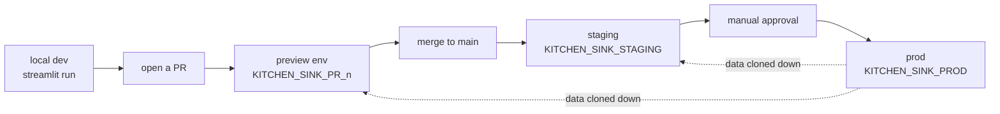

# CI/CD and environment promotion

The [previous chapter](02-rights-model.md) left you running `just` recipes by hand
against a single connection. That's fine for one person on one laptop; it stops being
fine the moment a second person shows up, or the moment you'd like to sleep through a
deploy. This chapter follows a single change from a dev's editor to production — and the
whole point of the setup is to make collaborating painless and the feedback loop tight:
edit locally and see it instantly, open a PR and get a live environment your reviewers
can actually click, merge and ship without anyone babysitting a deploy.

## The shape of it

Laptop to production, at a glance:



Code moves left to right — promoted *up* through environments by GitHub Actions — while
data moves the other way, cloned *down* from prod. **Code goes up, data comes down.** The
app never carries an environment inside it: it resolves `CURRENT_DATABASE()` at runtime
and queries its own `DATA` schema, so the *identical artifact* runs in every tier. That's
what makes per-PR preview environments essentially free — a preview is just the same app
pointed at a different database.

| Tier | Database | Lifecycle |
|------|----------|-----------|
| **prod** | `KITCHEN_SINK_PROD` | source of truth; app promoted here behind an approval gate |
| **staging** | `KITCHEN_SINK_STAGING` | app deployed on merge to `main`; `DATA` is a scheduled clone of prod |
| **preview** | `KITCHEN_SINK_PR_<n>` | ephemeral, per-PR; transient db cloned from prod, dropped on close |

The rest of this chapter walks that path one step at a time.

## Monday morning: working locally

The foundation — roles, databases, warehouse (`just setup`) and prod's source-of-truth
data (`just data-prod`) — is stood up **once**, when the project is first set up. A dev
joining later doesn't touch any of that. They just pull down fresh data into staging:

```sh
just refresh-staging my_connection
```

From there the day-to-day loop runs on their own machine. They drop their dev connection
into `app/.streamlit/secrets.toml` (a `[connections.snowflake]` block — gitignored, never
committed) and just run Streamlit:

```sh
cd app && streamlit run streamlit_app.py
```

The app opens at `localhost:8501` and hot-reloads on every save — that's the real inner
loop, editing Python and watching the browser, no deploy round-trip. Local is where the
bulk of the work happens: layout, queries, business logic.

When you're ready to see it running as a deployed app, you don't push to shared staging
by hand — you open a pull request and let the pipeline hand you a deployed environment of
your own.

## Opening a PR: a whole environment appears

This is the fun part. The moment the PR opens, `pr-preview` fires and builds a complete,
disposable environment just for that PR:

- it provisions a **transient** database, `KITCHEN_SINK_PR_<n>`,
- **zero-copy clones** `PROD.DATA` into it (fresh production data, isolated),
- deploys the app against that database, and
- posts the preview URL as a PR comment — updating the same comment on every push.

A reviewer clicks a link and sees *this exact change* running against real data, in a
sandbox that can't touch anything else — no pulling the branch, no "works on my machine,"
no reading a diff and imagining the result. That's the tight loop the whole setup is
after: the distance between "I pushed a commit" and "you're clicking my change" is one
comment. Nobody provisioned the environment, nobody will remember to delete it, and —
since it's just the same app pointed at a fresh database — it costs almost nothing.

## Merge: staging updates itself

The PR gets approved and merged. `deploy-staging` runs on every push to `main` and
promotes the app code to staging — no ceremony, no manual step. Staging is always
"whatever's on `main`," which makes it the true rehearsal space for what prod is about
to become.

## Promotion: the one deliberate, gated step

Prod is the only deploy a human is *supposed* to touch, and even then barely.
`promote-prod` is a manual `workflow_dispatch` — you have to type `promote` to confirm —
and it runs against the `production` GitHub Environment, which is configured with
required reviewers. So the flow is: someone triggers it, someone (else) approves it, and
only then does the app deploy to `KITCHEN_SINK_PROD` as the prod owner role. Everything
up to this point was automatic; this is the one spot where the pipeline waits for a human
to say "yes, ship it."

## The identity doing all this is least-privilege

Every workflow authenticates as the `KS_DEPLOYER` service user (key-pair /
`SNOWFLAKE_JWT`) using the `KS_APP_DEPLOYER` role. That role holds exactly what the
pipeline needs and nothing more — the environment owner roles (to deploy and own apps),
`CREATE DATABASE` (for preview dbs), `MANAGE CALLER GRANTS`, and `CREATE SCHEMA` on
staging. It is **never** granted `SYSADMIN` or `ACCOUNTADMIN`. The clone-and-provision
SQL runs entirely inside this scoped role, so a compromised CI token is a bad day, not a
catastrophe.

To wire this up you need:

- **GitHub secrets:** `SNOWFLAKE_ACCOUNT`, `SNOWFLAKE_USER` (`KS_DEPLOYER`), and
  `SNOWFLAKE_PRIVATE_KEY`.
- **A `production` environment** with required reviewers — the promote-prod gate above.
- **Network access.** If the account enforces an IP/VPN network policy, GitHub-hosted
  runners (dynamic IPs) get blocked. Two ways out:
  - A **self-hosted runner** inside the allowed network — narrowest, changes no policy,
    and the right call for strict environments.
  - A **user-scoped network policy** on `KS_DEPLOYER` that allowlists GitHub Actions IP
    ranges (a user-level policy overrides the account policy for that user only).
    `scripts/refresh_gh_actions_network_policy.py` builds it, and the
    `network-policy-refresh` workflow re-runs weekly because GitHub rotates those ranges
    — all under a narrow `KS_NETPOLICY_ADMIN` role that owns only that policy. The
    catch: it allowlists *all* GitHub runner IPs, which is broad, so prefer the
    self-hosted runner when narrow IPs matter.

## PR closes: it cleans up after itself

Merge or close the PR and `pr-teardown` fires, dropping `KITCHEN_SINK_PR_<n>` outright.
Because the preview database is transient and nothing else depends on it, teardown is a
single `DROP DATABASE` — no orphaned apps, no lingering clones, no quarterly hunt for
"what is this and can I delete it."

## Why previews clone prod, not staging

One deliberate choice worth defending: only the automated pipeline — never a developer —
holds the privilege to clone prod. So PR previews get the freshest possible data while
raw prod access stays confined to the audited CI identity. For genuinely sensitive data
you'd clone from a masked or sanitized source instead; here the data is synthetic, so
cloning prod directly is both safe and the most honest preview you can give a reviewer.

---

And that's the whole loop: a change starts in an editor, proves itself in an ephemeral
preview, rehearses in staging, and lands in prod behind a single human "yes" — with the
same app artifact the entire way and a least-privilege robot doing the driving. Head back
to the [docs index](README.md) if you want to start over, or go read the SQL and the
workflows themselves — at this point they should read like old friends.
