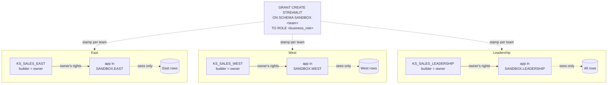

# The citizen developer, or: building on your own data

Every customer conversation that starts with "how do we share apps" eventually
sprouts a second one: "...and how do we let our own analysts *build* apps
without handing them the keys to everything?" The first three chapters answered
the first question. This one is about the second.

So far every app in this repo has been a *curated* one — a short list of build
roles ships it, it's shared to everyone through `KS_STREAMLIT_VIEWER`, and a
restricted caller's-rights connection plus a row access policy decides what each
viewer sees. That's exactly the right shape when a small team owns a handful of
apps the whole company leans on.

But the hierarchy from the [first chapter](01-rbac.md) has nothing to say to the
analyst who just wants to build something on the numbers they can already see.
Can a citizen developer — an analyst, a DE, someone out in a business unit —
build their own Streamlit app, bounded to the data they're already entitled to?
They can. And the shape it takes turns out to be the mirror image of everything
we've built so far.

## First, the caveat that makes all of this OK

One framing the rest of the chapter leans on: **these apps are not
business-critical.** The curated apps from the first three chapters carry the
company — they earn CI/CD, a staging rehearsal, a gated prod deploy, an immutable
artifact promoted through environments, precisely because when one breaks,
something that matters breaks. Citizen-dev apps sit at the opposite end of that
spectrum: an analyst's exploratory dashboard, a team's throwaway view of this
quarter's numbers, the thing somebody spins up on Tuesday and has forgotten by
Friday. Ephemeral, personal-to-small-group, and — the important part — nobody's
payroll run depends on them.

That single property is what licenses everything below. You don't wrap a
disposable app in a promotion pipeline, and you don't need to: the blast radius
of a mistake is a handful of people looking at data they were already entitled to
see. Where the curated model spends its complexity budget on *governance*, the
citizen-dev model spends it on *getting out of the way*. So every time this
chapter relaxes a rule the earlier ones enforced, it's doing it on purpose —
the stakes are simply different.

And getting out of the way means meeting these builders where they already are.
The analyst who wants a quick dashboard is not going to clone a repo, wire up a
local `streamlit run`, or learn the Git dance from the [CI/CD chapter](03-cicd.md)
— nor should they have to. They want to open a browser, write some Python, and
watch it run. That instinct is the right amount of process for
an app nobody's quarter depends on. So the rest of this chapter really has two
audiences: a **platform team** that stands up a safe sandbox once, and a
**citizen dev** who then never leaves Snowsight.

## The conflict

Look at the ladder a would-be builder can climb in
[`sql/00_foundation/01_roles.sql`](../sql/00_foundation/01_roles.sql). There are
exactly two rungs, and neither one fits a citizen developer:

- **A build role** (`KS_APP_STAGING`, `KS_APP_DEPLOYER`, `KS_APP_OWNER_PROD`)
  can create apps but carries zero data grants of its own. That's deliberate —
  the curated apps read data through the *viewer's* caller's rights, so the
  builder never needs any. But it also means a citizen dev handed a build role
  can't build on *their* data at all; the role can't `SELECT` a thing.
- **`KS_APP_ADMIN`** can build *and* see data — but only because it inherits
  *every* business role (`01_roles.sql` grants `KS_SALES_EAST`, `KS_SALES_WEST`,
  and `KS_SALES_LEADERSHIP` straight into it). Hand that to a citizen dev and
  you've minted a regional-data superuser.

There's no rung in between — nothing that says "can create apps, bounded to the
data this person already has." That missing middle is the whole problem, and it
exists because of a single convenience: the business roles roll up into
`KS_APP_ADMIN` so one operator can impersonate any region while testing. Handy
for a lone governance operator; fatal the moment you want *authorship* to be
self-service, because the only role that can both build and read data reads
*all* of it.

## `CREATE STREAMLIT` has nothing to do with data

Here's the thing the ladder obscures: `CREATE STREAMLIT` is a schema-level
privilege, and it says nothing whatsoever about which tables you can read. This
repo *centralizes* it onto a few build roles on purpose. To make authorship
self-service you do the exact opposite — you *decentralize* it: grant `CREATE
STREAMLIT` on a per-person or per-team **sandbox schema**, directly to the
business role that person already holds, and let the rights model draw the data
boundary for you.

So a `KS_SALES_EAST` citizen developer:

- gets `CREATE STREAMLIT ON SCHEMA SANDBOX.EAST` granted to `KS_SALES_EAST`
  (plus `USAGE` on a warehouse and a compute pool),
- builds an owner's-rights app owned by `KS_SALES_EAST`,
- and that app can query exactly — and *only* — what `KS_SALES_EAST` can
  `SELECT`.

Not because a policy filters it, but because the app runs as their own role and
their grants *are* the fence. They can't even author an app that references a
table they can't read — the privilege check fails the moment they try. That's
the cleanest possible answer to "only on the data they're privy to": it's
enforced by the grant they already have, with no god-role anywhere in sight.

## The inversion

Back in the [rights-model chapter](02-rights-model.md), owner's rights was the
villain — an owner's-rights app shared broadly hands every viewer the owner's
full, unfiltered data. But that was only ever dangerous because the owner
(`KS_APP_ADMIN`) was omniscient. Make the owner a *narrow* business role and the
same mechanism flips from liability to feature: owner's rights becomes a
containment boundary you get for free.

The two models are really the same axis seen from opposite ends:

| | Curated (chapters 1–3) | Citizen developer |
|---|---|---|
| Who builds | A data-less central build role | The dev's **own business role** |
| Rights model | **Restricted caller's** rights | **Owner's** rights |
| What bounds the data | Row access policy + viewer's grants | The **builder's own grants** |
| Shape | One app, shared to everyone, filtered per viewer | Many small apps, each bounded to a team's data |
| `CREATE STREAMLIT` | Centralized on a few build roles | Decentralized onto sandbox schemas |
| Blast radius of a mistake | A viewer sees rows they shouldn't (policy bug) | A viewer sees the *builder's* rows (over-share) |

And because the recipe is just "a schema and a grant," it's a template you stamp
out once per team — same three lines of SQL, a different role and schema each
time. It scales sideways with no new roles and no new central plumbing, and no
app can ever reach another team's rows:



Each lane is self-contained: the arrows never cross, so East's app *cannot* read
West's rows no matter who opens it. A fourth team — `KS_SALES_CENTRAL`, say — is
one more lane, not a redesign.

### Why not caller's rights?

If you've read the [rights-model chapter](02-rights-model.md), the obvious
objection is: the curated apps use caller's rights, so why flip citizen-dev apps
to owner's? Caller's rights even looks *safer* on the one axis owner's rights is
weak on — a West user who opens an East caller's-rights app would see nothing,
where the same over-share of an owner's-rights app leaks East data. So why not
reach for it here?

The first thing to know is that the choice isn't symmetric. Streamlit in
Snowflake has **no plain, unrestricted caller's-rights mode** — apps run with
owner's rights by default, and the only alternative is *restricted* caller's
rights, which the curated model uses. And "restricted" comes with strings that
land squarely on the thing this chapter is trying to make self-service:

- **It re-centralizes authorship.** Restricted caller's rights only lets an app
  touch an object on the viewer's behalf once an admin holding `MANAGE CALLER
  GRANTS` has issued a **caller grant** for it (`GRANT CALLER SELECT ON TABLE …`).
  So the citizen dev can't just build on data they can already see — every table
  their app reads needs a privileged operator to bless it first. That's the exact
  central plumbing the sandbox recipe deletes: with owner's rights, the builder's
  *existing* `SELECT` is the whole story.
- **The app stops working uniformly.** The data boundary becomes each *viewer's*
  grants, so two people on the same team with slightly different access get
  different results — or errors. The builder can't test once and trust it works
  for everyone. Owner's rights is deterministic: every viewer sees exactly what
  the builder saw.
- **It's runtime-coupled.** Restricted caller's rights runs only in the container
  runtime (and needs a recent Streamlit version); owner's rights works there
  *and* in warehouse runtimes. A dev pressing **Deploy** shouldn't have to reason
  about which one they're on.

The over-share edge caller's rights seems to win is one you've already bought
elsewhere — the managed-access schema below fences *who* an app reaches, and
leaving the row policy on the base tables makes an accidental over-share degrade
gracefully instead of spilling the lot. And the classic caller's-rights *danger*
— untrusted app code running with a privileged caller's full rights — doesn't
apply either: Snowflake only offers the *restricted* variant, and a narrow owner
caps the blast radius anyway. So caller's rights would buy you no safety you
don't already have, in exchange for dragging a `MANAGE CALLER GRANTS` operator
back into the middle of every app. Owner's rights isn't the reckless choice here;
it's the one that keeps authorship self-service.

## Where the tension moves

Decentralizing authorship doesn't make the tension disappear; it moves it from
creation to consumption. An owner's-rights app shows *every* viewer the owner's
data, so a `KS_SALES_EAST` app is only safe to share within the East
entitlement. Grant its `USAGE` to a West user and you've leaked East data —
owner's rights sails straight past the viewer's own grants.

Two things keep that honest:

- **Control who an app can be shared to.** A citizen-dev app should reach only
  the builder's own business role, never `KS_STREAMLIT_VIEWER` or `PUBLIC`.
  *Build on your data, share to your team.* Whether that's a polite convention
  or an actual boundary comes down to how you cut the sandbox schema — which is
  the whole of the next section.
- **Leave the row access policy on the base tables.** Then even an owner's-rights
  app is row-filtered, and an accidental over-share degrades gracefully instead
  of spilling the lot. It's the same trick from the rights-model chapter: a
  policy that references its mapping table *unqualified*, so each environment's
  clone quietly rewires to its own copy.

And a citizen dev who genuinely needs to share *broadly* while still filtering
per viewer hasn't discovered a new problem — they've wandered right back into the
curated model, caller's rights and row policy and all. The tidy part is that in
that mode they need no special data access to build at all; `CREATE STREAMLIT`
on a sandbox schema is the whole shopping list.

## Wait — can the builder just share it themselves?

This is the question that decides whether you can *sleep at night* with this
model. By default, the answer is yes. When a citizen dev creates a
Streamlit their role becomes its owner, and in Snowflake ownership carries the
right to grant privileges on the thing you own — full stop. There's no separate
"sharing" privilege to withhold, and you don't need any privilege on the *target*
role to grant to it. Nothing at the privilege layer stops this:

```sql
-- Runs fine for the owner. There is no "share" privilege gating it.
GRANT USAGE ON STREAMLIT sandbox.east.my_app TO ROLE ks_sales_west;
GRANT USAGE ON STREAMLIT sandbox.east.my_app TO ROLE public;
```

For an owner's-rights app that's the leak, undisguised: the grantee runs it *as
the owner* and sees East data. The one accidental brake is that they also need
`USAGE` on the containing database, schema, and warehouse or compute pool to
open it — but that's friction, not a fence, and a dev who owns the sandbox schema
can grant the schema `USAGE` right alongside. So the default is an uncomfortable
one: a citizen dev can share their app with anyone, up to and
including the entire account.

### The lever: a managed-access sandbox schema

The fix is one clause on the schema — create each sandbox `WITH MANAGED ACCESS`:

```sql
CREATE SCHEMA sandbox.east WITH MANAGED ACCESS;
```

In a managed-access schema, the grant pen changes hands:

- The citizen dev still creates *and owns* the app — authorship is untouched.
- But an object owner can no longer grant privileges on their own objects. Only
  the *schema owner* (or a role holding `MANAGE GRANTS`) can. The dev's `GRANT
  USAGE …` above simply fails.

Which cleanly splits the two verbs you actually care about:

| Verb | Plain schema | `MANAGED ACCESS` schema |
|------|--------------|-------------------------|
| **Build** an app (`CREATE STREAMLIT`) | Citizen dev | Citizen dev |
| **Own** the app | Citizen dev | Citizen dev |
| **Share** it (`GRANT USAGE`) | Citizen dev — *to anyone, incl. `PUBLIC`* | **Schema owner only** |

That's the whole difference between *hoping* people follow "share to your team"
and *enforcing* it. The dev builds freely on their own data; a central role
reviews and issues every grant. Sharing stops being something that happens by
accident and becomes a deliberate, auditable act — the builder proposes, the
schema owner disposes.

## "Can I just share it with one person?"

This is the single most common question I get about all of this, and the first
answer is a letdown: **Snowflake doesn't share with people. It shares with
roles.** There's no `GRANT USAGE … TO USER bob` — privileges land on roles, and
you put Bob in a role. So "share this app with exactly one colleague" has no
native one-liner; taken literally it means "spin up a role whose only member is
that colleague," which sounds an awful lot like the per-app-role snarl the [first
chapter](01-rbac.md) told you to run from.

The way out is to notice those are *different* snarls. Chapter one warned against
a viewer role **per app** — mint enough of those and nobody can remember which one
gates what. A role **per person**, reused across every throwaway app they're ever
handed, is a different animal; plenty of orgs already run exactly these ("user
roles"), and because these apps are disposable, granting to somebody's personal
role is cheap and forgettable in the good way. If you're going to hand-share to
individuals, share to *people-shaped* roles, not *app-shaped* ones.

But for a throwaway app, reaching for object grants at all is often the wrong
frame. These builders aren't deploying governed objects and granting them out —
they're working somewhere the question barely comes up.

## Where they'd rather work: the workspace

A citizen dev wants none of the machinery: no Git, no
`connections.toml`, no local `streamlit run`, no CLI. They want to open
[a Snowsight workspace](https://docs.snowflake.com/en/user-guide/ui-snowsight/workspaces-shared),
add a Streamlit app, write Python in the browser — or just describe the app to
[Cortex Code](https://docs.snowflake.com/en/user-guide/cortex-code/cortex-code)
(CoCo) and let it write the Python for them — and press **Run**, which
spins up a private *development app* only they can see, the in-platform
equivalent of localhost with none of the setup. When it's ready, **Deploy** turns
it into a Streamlit object. The whole Git-and-laptop apparatus from the earlier
chapters is precisely the thing they're opting out of.

A *shared* workspace turns that into a team sport, and — happily — it's also the
cleanest answer to the "one person" question above. Three things fall out of it,
all in your favor:

- **They run it as themselves.** Anyone with access to a shared workspace runs
  the app *with their own privileges*, not the owner's. That quietly deletes the
  owner's-rights leak from the last two sections — there's no deployed
  owner's-rights object handing over the builder's data, because every person
  executes under their own grants. Leave the row policy on the table and each
  viewer sees precisely their slice, for free.
- **You're sharing code, not a governed asset.** A shared workspace is a
  wiki-style space with per-file drafts, publish, and a publish history you can
  roll back through — about the right amount of ceremony for something meant to
  be thrown away. No pipeline, no immutable artifact, no prod schema.
- **Deploy stays locked down.** Only the workspace *owner* role can promote a
  `STREAMLIT` object out of it, so "a few people can collaborate and run" never
  quietly turns into "a few people shipped to prod."

The catch — there's always one — is that workspace access is *still* granted to
roles, not individuals; you pick roles when you create or configure a shared
workspace. So the workspace doesn't conjure per-user grants any more than the
deployed object did. What it does is make the granularity **stop mattering**:
because everyone runs as themselves against a per-user row policy, sharing the
workspace a shade too broadly leaks nothing. That's the real resolution to "how
do I share with one person" — you mostly stop needing to, because the data layer
is already doing the per-person part for you.

## The one thing you'd change

None of the existing setup has to come out. The two models sit side by side:
curated production apps keep flowing through `KS_APP_ADMIN` and the CI/CD from
the [CI/CD chapter](03-cicd.md), while citizen-dev apps live in sandbox schemas
under business roles. The single habit worth dropping is the "inherit every
business role so I can test as any region" shortcut. Test-viewing shouldn't
require the *builder* role to be omniscient — let people test by assuming a
business role they actually belong to, or a dedicated QA role seeded with test
rows through the row policy. Break that one coupling and the missing middle rung
appears on its own.

## Try it

Remember the two audiences — and which one you are. **Your citizen devs** do none
of the commands below; they open a workspace, write an app (or let CoCo write it
for them), press Run, then Deploy into the sandbox schema you've prepared for
them. **You** — the platform team — run the recipes here once: the one-time
scaffolding that makes that sandbox safe, the schema, the managed access, the
grants. The recipes are the enablement; the workspace is their workflow.

Assuming the foundation is already up (`just setup <conn>` — the `KS_*` roles and
`KS_WH` are all it needs; the sandbox brings its own data), the whole thing stands
up in three commands:

```sh
just citizen-setup <conn>    # SANDBOX.EAST + SANDBOX.WEST, managed-access, granted to the business roles
just citizen-deploy <conn>   # deploy the owner's-rights app as each team's own role
just citizen-verify <conn>   # watch the fence hold
```

`citizen-setup` creates a `SANDBOX` database with a managed-access schema per
team, grants `CREATE STREAMLIT` on each to the matching business role, and seeds
each team its own `SALES` table with `SELECT` granted only to that role — the
object grant *is* the boundary, no row policy in sight. `citizen-deploy` then
deploys the identical `app_citizen/streamlit_app.py` twice: once as
`KS_SALES_EAST` into `SANDBOX.EAST`, once as `KS_SALES_WEST` into `SANDBOX.WEST`.
Each role owns the app it deploys. (In real life a citizen dev wouldn't run this —
they'd press **Deploy** in their workspace, targeting the same `SANDBOX.<team>`
schema. The recipe is just the scriptable stand-in so the whole demo runs without
clicking through the UI.)

`citizen-verify` is where the argument turns into output. It shows the East role
reading East, then flatly denied on West; it shows that role *failing* to `GRANT
USAGE` on its own app — managed access won't let a builder self-share — and then
the schema owner doing that same grant successfully. Build on your data, share to
your team, and let the schema own the sharing.

`just citizen-teardown <conn>` drops the `SANDBOX` database when you're done; the
curated `KITCHEN_SINK` environments and the `KS_*` roles are left untouched.

## Next Up

That's both ends of the spectrum living in one repo: a curated app promoted
through environments behind a gate, and a citizen-dev app that lives fast and
cheap on its owner's own grants. What happens when one of those cheap little apps
turns out to be indispensable? That's [the next chapter](05-promotion.md) — the
on-ramp from sandbox to business-critical. Or head back to the [docs
index](README.md), or go poke at [`sql/40_citizen_dev/`](../sql/40_citizen_dev/)
and [`app_citizen/`](../app_citizen/), which should read like the rest by now.
