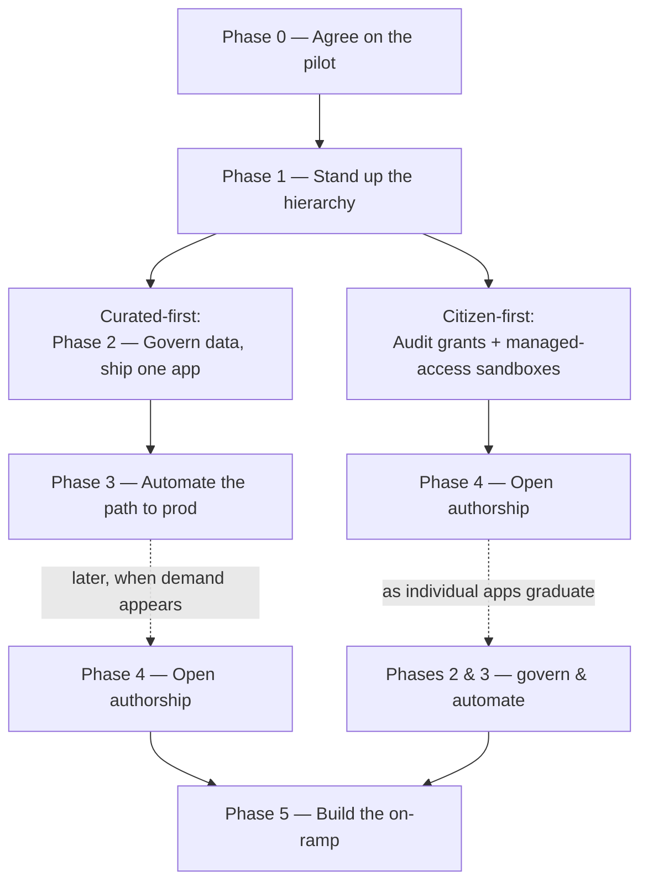

# Rolling it out: from convinced to shipped

You've read the other five chapters and you're nodding along — *we need this.*
But agreeing with a reference architecture and standing one up in your own
account are separated by a gap that swallows good intentions whole. This chapter
is the bridge across it: not more theory, but a program plan. How do you get from
zero to a self-service app platform without betting the company on a big-bang
migration, and how do you show your sponsor a win at every step so the effort
keeps its funding?

The answer is a **phased rollout** — but not a single fixed march. Phase 0 and
Phase 1 are shared bedrock everyone lays first; after that the order forks on what
your org came for. Some lead with the curated apps the whole company
leans on; others come in hot for democratized authorship and want the gates open
to citizen developers on day one. Both are legitimate, and the plan below serves
both — because every phase is built to be *independently valuable and safe to stop
on*. You are never stranded mid-migration, and nobody's quarter depends on you
finishing the whole thing in one go.

## What makes a phase a phase

Every phase in this plan is defined by three things, and it's worth being strict
about all three — vague phases are how rollouts quietly stall:

- **An outcome** — what is *true* when you're done, stated as a capability, not a
  task. "A viewer role provably cannot create an app," not "ran `01_roles.sql`."
- **A definition of done you can confirm in a retro.** Not a script to run — a
  short list of things you can *look back over the work and check off*. If you
  can't point at the finished phase and say "yep, that happened," the phase isn't
  done, however much SQL got executed.
- **What it unlocks** — the value you can show now, and what this phase makes
  possible afterward. This is where adoption compounds: each phase puts more real
  workloads on the platform than the one before it.

Start narrow on purpose. One real table, two or three business roles you
*already* have, and one app people keep asking for — or one team itching to build.
The model scales sideways later for almost nothing, so there's no prize for
starting wide — only risk.

## Two paths, one foundation

The six phases are **capabilities**, each labelled by the chapter that explains
it — not a fixed marching order. **Phase 0** (scope) and **Phase 1** (the
hierarchy) are the bedrock both paths lay first. After that the sequence forks on
why you came:

- **Curated-first** — your pain is the apps everyone leans on. Govern the data and
  ship one app (2), automate its path to prod (3), and open authorship (4) later,
  once there's demand for it.
- **Citizen-first** — your energy is democratization and you want the gates open
  early. Confirm your business-role grants are already trustworthy and cut
  managed-access sandboxes, open authorship (4) right away, then pull governance
  and CI/CD (2, 3) in as individual apps graduate.

Both converge on the on-ramp (5). The **dotted arrows are the deferred phases** in
each path — real work, but not prerequisites. Outside the shared foundation, these
phases don't form a dependency chain. What neither path can skip is a single
shared non-negotiable, spelled out in Pacing below.

## Phase 0 — Agree on the pilot

No SQL. The work here is a conversation, and skipping it is the most common way
this whole effort goes sideways three phases later. You are choosing the smallest
thing that still proves the model, and getting the people who own the data to
agree on who should see what — *before* anyone encodes that in a policy.

**Outcome:** a one-page scope naming the pilot table, the two or three existing
business roles that gate it, the entitlement dimension (region, business unit,
cost center — whatever slices your rows), your first deliverable — the app
everyone keeps asking for if you're curated-first, or the first team you'll hand a
sandbox if you're citizen-first — and the named platform owner who'll shepherd the
rollout.

**Done when — a retro you can run:**
- We can name the one table and the first thing we'll ship (an app, or a team's
  sandbox), and nobody's arguing for more yet.
- We wrote down, per role, which rows they should see — and the data owner agreed.
- One person owns this rollout, and everyone knows who it is.

**What it unlocks:** everything downstream is now scoped. You've turned "we should
govern our apps" into a concrete, bounded first deliverable a sponsor can track.

> **Worked example.** In this repo the pilot is `SALES_BY_REGION`, sliced by
> `region`, with `KS_SALES_EAST` / `KS_SALES_WEST` / `KS_SALES_LEADERSHIP` as the
> business roles and one app to show it off. That's the entire scope — one modest
> table and a handful of people who want to look at it.

## Phase 1 — Stand up the hierarchy

Now the foundation from the [role-hierarchy chapter](01-rbac.md): separate the
three questions that only *look* like one — who may build, who may open, who may
see. The deliverable is structural; there's no app yet, and that's fine.

**What you emphasize here depends on your path.** It's the same set of roles
either way, but the two paths lean on different parts of it first:

- **Curated-first** needs all three layers now — build roles, the broad entry
  role, and the business roles — because phase 2 is about to ship a
  broadly-shared app through them.
- **Citizen-first** leans hardest on the **business roles being correctly scoped**
  (plus a warehouse and compute to run on). The build roles and the broad entry
  role can wait: a citizen dev builds *as their own business role* into a sandbox,
  never through a build role or the `PUBLIC` viewer. Getting those business-role
  grants right *is* the up-front audit that phase 4 leans on.

**Outcome:** build, access, and data live in three distinct sets of roles. A
short list of build roles can create apps; a broad entry role lets everyone
*open* them; your existing business roles gate what's *inside*.

**Done when — a retro you can run:**
- A person holding only the entry/viewer role tried to create an app — and
  couldn't. (Opening and building are different verbs, and we watched the
  difference hold.)
- A build role tried to `SELECT` the pilot table — and couldn't. Build roles
  carry no data grants of their own.
- The broad entry role reaches everyone, and no one had to mint a per-app role to
  get there.

**What it unlocks:** a safe place to put apps and the role spine both paths build
on — the governance layer that phase 2's policies attach to for curated apps, or
the correctly-scoped business roles that fence sandboxes for citizen-first.

> **Worked example.** `just setup <conn>` creates the `KS_*` roles, the
> `KITCHEN_SINK_STAGING` / `KITCHEN_SINK_PROD` databases, and `KS_WH`;
> `just verify <conn>` echoes back the roles, the `PUBLIC` viewer grant, and the
> governance role's inheritances so you can eyeball that the shape is right.

## Phase 2 — Govern the data, ship one app

This is the **curated-first centerpiece** — the milestone that sells *that* path.
Put the row access policy and masking on the pilot table, populate the entitlement
mapping, and deploy one curated app, shared broadly, that filters at the data
layer. Then open it as two different people and watch them see different data.

**Citizen-first orgs don't start here.** They reach this machinery later — when a
sandbox app graduates and, for the first time, needs to be shared past its own
team while still showing each viewer only their slice. That's exactly what this
phase builds; citizen-first just pulls it in per graduated app instead of laying
it down up front. So it's the curated path's first deliverable; the low number
doesn't make it everyone's second step.

**Outcome:** a single app, shared broadly, where what each viewer sees is decided
by governance on the table and not by who clicked the link.

**Done when — a retro you can run:**
- Two people in different business roles opened the *same* app and saw *different*
  rows — and we watched it happen, we didn't just assume it.
- A non-privileged viewer saw the sensitive column masked; the owner saw it clear.
- A person with no entitlement opened it and got a polite empty view — no error,
  no leak.
- Nobody had to touch the app's code to make any of that true.

**What it unlocks:** proof, on *your* data, that the model works — the single
highest-persuasion artifact on the curated path. This is the screenshot that goes
to the exec sponsor and unlocks the appetite to automate and expand it.

> **Worked example.** `just data-prod <conn>` builds the governed table, the
> `USER_REGION_MAP`, and the row/masking policies; `just deploy <conn>` ships the
> app that runs the same query through an owner's-rights and a restricted
> caller's-rights connection side by side. The [rights-model
> chapter](02-rights-model.md) is the narration for what you'll see.

## Phase 3 — Automate the path to prod

A curated app that a human hand-deploys at 5pm on a Friday is a curated app
waiting for an incident. This phase follows the [CI/CD chapter](03-cicd.md): code
promoted *up* through environments, data cloned *down* from prod, and a single
gated step where a human says "ship it." Like phase 2, this is curated-path work —
citizen-first reaches it only when a graduated app needs a repeatable, gated route
to prod, and can happily ignore it until then.

**Outcome:** nobody hand-deploys to production. Opening a pull request yields a
live, clickable preview environment; merging updates staging on its own; prod is
one deliberate, reviewed click.

**Done when — a retro you can run:**
- We opened a throwaway PR and a reviewer clicked a working preview URL without
  pulling the branch or trusting a screenshot.
- Merging to main updated staging with no manual step.
- Promoting to prod required a human approval — and the identity doing the
  deploying holds nowhere near `ACCOUNTADMIN`.
- Closing the PR cleaned up its environment with nothing left orphaned.

**What it unlocks:** velocity without the Friday-deploy risk — and the per-PR
preview clones are your first step-up in platform usage, each a full environment
that costs almost nothing and disappears on its own.

> **Worked example.** The GitHub Actions workflows and the `KS_DEPLOYER` service
> role are already in the repo; `just refresh-staging <conn>` is the manual stand-in
> for the scheduled clone-down. Wire the three GitHub secrets and a `production`
> environment with required reviewers, and the pipeline drives itself.

## Phase 4 — Open up authorship

The phase that hands building to the people who came for it — the
[citizen-developer chapter](04-citizen-developers.md). An analyst builds their own
app, bounded to the data they already hold, with a sandbox instead of a pipeline.
Citizen-first orgs reach this early; curated-first orgs arrive here once the
governed platform is humming. Either way the mechanics are the same.

**Before you open the gates** — early or late — one thing has to be true: the
business roles you're handing sandboxes to must already see *only* what they
should. Owner's-rights apps faithfully expose whatever the builder's role can
read, so this phase surfaces your existing RBAC hygiene, warts and all.
Curated-first orgs mostly settled this back in phase 1; citizen-first orgs do the
audit up front, as the first move of the path. Skip it and "self-service" becomes
"self-service data leak."

**Outcome:** one real team can build owner's-rights apps on their own data in a
managed-access sandbox, and cannot over-share them even by accident.

**Done when — a retro you can run:**
- Someone on the pilot team built and ran an app on their own data without asking
  the platform team for a single new data grant.
- That builder tried to share their app outside the team — and the managed-access
  schema stopped them; only the schema owner could issue the grant.
- The team's app could read the team's rows and provably not another team's.

**What it unlocks:** self-service that scales *sideways* — the next team is one
more sandbox, not a redesign. This is the phase where app count and platform usage
multiply, because you've stopped being the bottleneck for authorship.

> **Worked example.** `just citizen-setup <conn>` stamps a managed-access
> `SANDBOX.<team>` schema per team; `just citizen-deploy <conn>` deploys the same
> owner's-rights app as each business role; `just citizen-verify <conn>` walks the
> fence — East reads East, is denied on West, fails to self-share, and only
> `SYSADMIN` can grant. `just citizen-teardown <conn>` drops it all.

## Phase 5 — Build the on-ramp

Open authorship long enough and one of those cheap sandbox apps turns out to be
indispensable. Without a path, "share it wider" becomes an incident — so this
phase, from the [promotion chapter](05-promotion.md), establishes how a proven
idea graduates into the curated model, and how the rest get triaged.

**Outcome:** a lightweight, agreed process for promoting a sandbox app into the
pipeline — and a rubric for which apps get promoted, kept, or retired.

**Done when — a retro you can run:**
- We took one real sandbox app through the promote / keep / retire decision.
- A promoted app was rebuilt as a curated, caller's-rights app owned by a platform
  role — not the sandbox object with a setting toggled.
- Everyone involved understood up front that promotion re-homes ownership to the
  platform team.

**What it unlocks:** the durable flywheel — incubate cheaply, promote the winners,
retire the dead — so the platform grows on its best ideas instead of drowning in
abandoned ones.

## Pacing: the one thing you can't skip

The phases aren't a strict dependency chain — that's why there are two paths. But
there *is* a single non-negotiable, and it is **not** "do phase 2 first."

**The invariant: no owner's-rights sandbox without (a) trustworthy role grants and
(b) managed access.** Opening authorship means apps run as the builder's own role,
so their grants *are* the fence — which is only safe if those grants are already
correct, and only contained if a managed-access schema stops a builder from
granting past them. Get either wrong and "self-service" becomes "self-service data
leak."

Notice what this invariant is *not*: it isn't the phase-2 row access policy. The
citizen sandbox brings its own data and fences with a plain object grant, so you
can open authorship (phase 4) before building any of the curated governance
machinery (phase 2). That's what the citizen-first path relies on, and why the
arrows out of phase 1 don't have to run through 2 and 3.

**Where each path can safely stop.** Curated-first can rest after phase 3: a
governed platform where a small team ships the apps the company leans on is a
complete, defensible story, and phase 4 can wait for demand. Citizen-first can
rest after phase 4: teams building on their own data behind managed access is
equally complete, with phases 2, 3, and 5 pulled in only when an app earns
promotion. Both are places to stop for good, not half-finished migrations.

## Where rollouts stall

The honest failure modes, so you can watch for them:

- **Skipping phase 0.** Picking a pilot table whose entitlements nobody actually
  agrees on. You'll discover the disagreement encoded in a policy, in production,
  in front of the wrong audience.
- **Boiling the ocean.** Trying to onboard every table and team at once instead of
  proving the model on one. The architecture scales sideways *later* precisely so
  you don't have to start wide.
- **Opening the gates on shaky grants.** The citizen-first temptation done wrong:
  handing out owner's-rights sandboxes before the business roles are trustworthy,
  or before managed access is in place. *That* — not "skipping phase 2" — is the
  ordering mistake that actually leaks data. See the invariant in Pacing.
- **Treating the entitlement map as a one-time load.** The mapping that drives row
  access is a living projection of who's on which team; wire it to the source that
  already knows that (your IdP or HR feed) rather than hand-editing rows forever.
  Keeping it honest at scale is a governance discipline in its own right — and a
  later chapter.

## Next Up

That's the rollout: a shared foundation — scope the pilot, stand up the
hierarchy — and then whichever order fits why you came. Curated-first governs the
data, automates the path to prod, and opens authorship later; citizen-first audits
its grants, opens the gates early, and pulls governance and CI/CD in as apps
graduate. Both converge on the on-ramp, and both pause wherever demand runs out. Later chapters will go
deeper on the disciplines this plan gestures at — auditing and attribution, the
entitlement source of truth, and carrying the model onto runtimes beyond Streamlit
in Snowflake. For now, head back to the [docs index](README.md), or open the
[justfile](../justfile) and read the phases as the recipes they map to.
